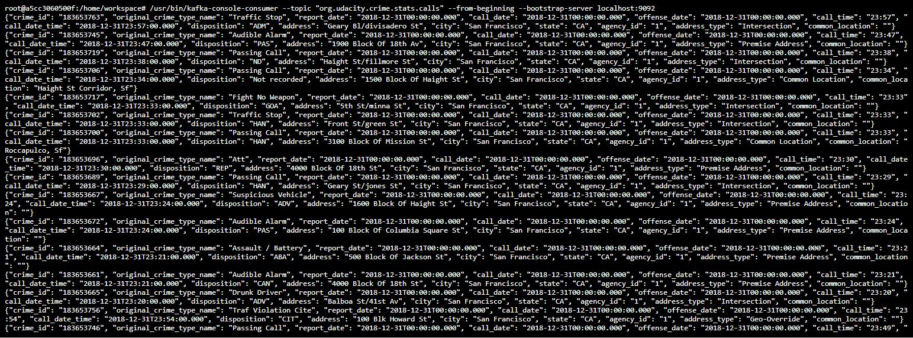
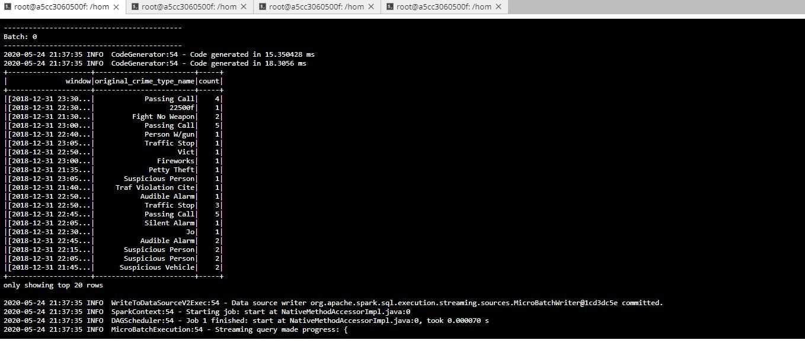

# SF Crime Statistics with Spark Streaming

In this project, you will be provided with a real-world dataset, extracted from Kaggle, on San Francisco crime incidents, and you will provide statistical analyses of the data using Apache Spark Structured Streaming. You will draw on the skills and knowledge you've learned in this course to create a Kafka server to produce data, and ingest data through Spark Structured Streaming.

## Development Environment
You will need to set up your environment properly as described below:

* Spark 2.4.3
* Scala 2.11.x
* Java 1.8.x
* Kafka build with Scala 2.11.x
* Python 3.6.x or 3.7.x

## Outputs

The dataset police-department-calls-for-service.json will be loaded into a kafka topic.

Starting Zookeeper:

```/usr/bin/zookeeper-server-start config/zookeeper.properties```

Starting Kafka Server:

```/usr/bin/kafka-server-start config/server.properties```

Creating a Kafka topic:

```kafka-topics --zookeeper localhost:2181 --create --topic org.udacity.crime.stats.calls --replication-factor 1 --partitions 2```

Starting Ingestion process:

```python kafka_server.py```

Consuming Data from the Kafka topic:

```/usr/bin/kafka-console-consumer --topic "org.udacity.crime.stats.calls" --from-beginning --bootstrap-server localhost:9092```



Starting the Spark Streaming process:

```spark-submit --packages org.apache.spark:spark-sql-kafka-0-10_2.11:2.3.4 --master local[*] data_stream.py```



Kafka Spark Structured Streaming application UI screenshot:


## Questions to be answered

How did changing values on the SparkSession property parameters affect the throughput and latency of the data?

  Changing the property parameters affected the rows processed per second `processedRowsPerSecond`.

What were the 2-3 most efficient SparkSession property key/value pairs? Through testing multiple variations on values, how can you tell these were the most optimal?

  A full set of SparkSession properties is available at http://spark.apache.org/docs/latest/configuration.html#viewing-spark-properties  
  I made changes to `maxRatePerPartition` and `spark.sql.shuffle.partitions` and analyzed the results in Spark Structured Streaming application UI.
